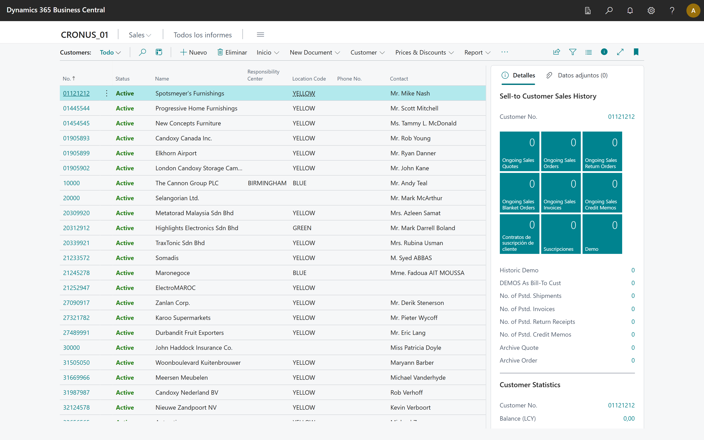
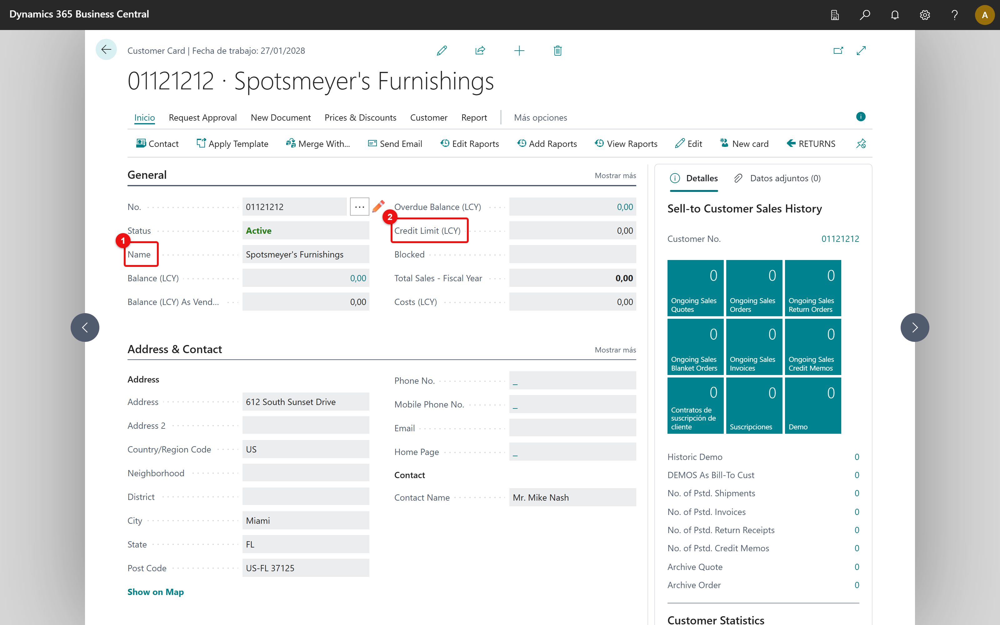

# Com crear un client

Aquesta guia mostra com obrir la llista de clients i emplenar els camps clau d'una fitxa.

## 1. Obre la llista de clients

Cerca "Customers" i obre la llista.

## 2. Emplena els camps clau

Indica el Nom i el Límit de crèdit del client.

